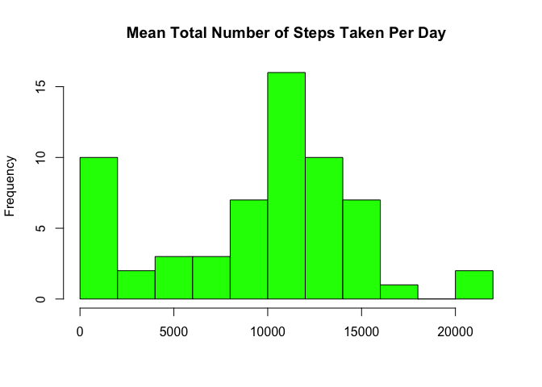
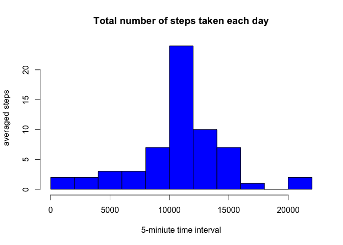
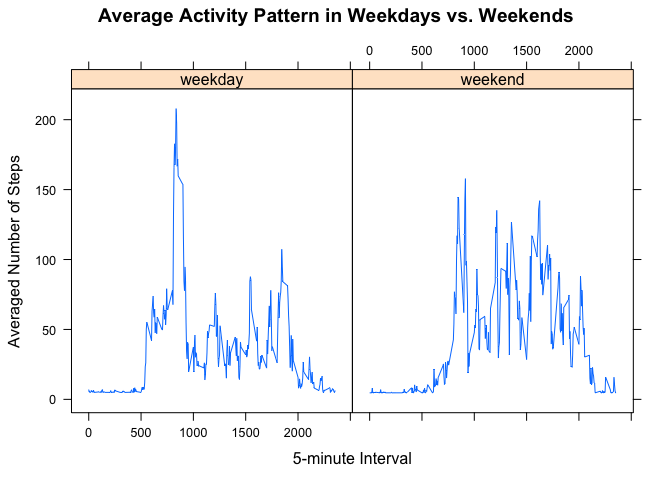

# Reproducible Research: Peer Assessment 1
## Loading and preprocessing the data

```r
setwd("/Users/pzhou5/Dropbox/Coursera/05 Reproducable Data")
download.file(url="https://d396qusza40orc.cloudfront.net/repdata%2Fdata%2Factivity",destfile="Activity_Monitoring_Data.zip",method="curl")
unzip("Activity_Monitoring_Data.zip")
```

```
## Warning in unzip("Activity_Monitoring_Data.zip"): error 1 in extracting
## from zip file
```

```r
Activity<-read.csv("activity.csv",head=TRUE,sep=",",na="NA")
head(Activity)
```

```
##   steps       date interval
## 1    NA 2012-10-01        0
## 2    NA 2012-10-01        5
## 3    NA 2012-10-01       10
## 4    NA 2012-10-01       15
## 5    NA 2012-10-01       20
## 6    NA 2012-10-01       25
```

```r
str(Activity)
```

```
## 'data.frame':	17568 obs. of  3 variables:
##  $ steps   : int  NA NA NA NA NA NA NA NA NA NA ...
##  $ date    : Factor w/ 61 levels "2012-10-01","2012-10-02",..: 1 1 1 1 1 1 1 1 1 1 ...
##  $ interval: int  0 5 10 15 20 25 30 35 40 45 ...
```

## What is mean total number of steps taken per day?
The mean total number of steps taken per day was 9354.23.
The mean total number of steps taken per day was 10395.

```r
library(dplyr)
```

```
## 
## Attaching package: 'dplyr'
```

```
## The following objects are masked from 'package:stats':
## 
##     filter, lag
```

```
## The following objects are masked from 'package:base':
## 
##     intersect, setdiff, setequal, union
```

```r
names(Activity)
```

```
## [1] "steps"    "date"     "interval"
```

```r
new_group<-group_by(Activity,date)
Summary<-summarise(new_group,total_steps=sum(steps,na.rm=TRUE))
Summary
```

```
## # A tibble: 61 × 2
##          date total_steps
##        <fctr>       <int>
## 1  2012-10-01           0
## 2  2012-10-02         126
## 3  2012-10-03       11352
## 4  2012-10-04       12116
## 5  2012-10-05       13294
## 6  2012-10-06       15420
## 7  2012-10-07       11015
## 8  2012-10-08           0
## 9  2012-10-09       12811
## 10 2012-10-10        9900
## # ... with 51 more rows
```

```r
hist(Summary$total_steps,col="green",main="Mean Total Number of Steps Taken Per Day",xlab=(""),breaks=10)
```

<!-- -->

```r
mean(Summary$total_steps)
```

```
## [1] 9354.23
```

```r
median(Summary$total_steps)
```

```
## [1] 10395
```

## What is the average daily activity pattern?
I calculated the averaged steps across all days for each 5-minute time invertal.
Then I plot it. Using which.max () function I found that 13:55pm is the time interval 
that had the max average steps across all days.


```r
interval_group<-group_by(Activity,interval)
interval_group
```

```
## Source: local data frame [17,568 x 3]
## Groups: interval [288]
## 
##    steps       date interval
##    <int>     <fctr>    <int>
## 1     NA 2012-10-01        0
## 2     NA 2012-10-01        5
## 3     NA 2012-10-01       10
## 4     NA 2012-10-01       15
## 5     NA 2012-10-01       20
## 6     NA 2012-10-01       25
## 7     NA 2012-10-01       30
## 8     NA 2012-10-01       35
## 9     NA 2012-10-01       40
## 10    NA 2012-10-01       45
## # ... with 17,558 more rows
```

```r
Interval<-summarize(interval_group,average_steps=mean(steps))
Interval
```

```
## # A tibble: 288 × 2
##    interval average_steps
##       <int>         <dbl>
## 1         0            NA
## 2         5            NA
## 3        10            NA
## 4        15            NA
## 5        20            NA
## 6        25            NA
## 7        30            NA
## 8        35            NA
## 9        40            NA
## 10       45            NA
## # ... with 278 more rows
```

```r
plot(average_steps~interval,Interval,type="l",ylab="Average Steps",xlab="Time interval",main="Average Daily Activity Pattern")
which.max(Interval$average_steps)
```

```
## integer(0)
```

```r
Interval[104,]
```

```
## # A tibble: 1 × 2
##   interval average_steps
##      <int>         <dbl>
## 1      835            NA
```

```r
835/60 # 
```

```
## [1] 13.91667
```

## Imputing missing values
The mean and median from the new dataset were different from the previous dataset, because replacing the missing value with the means make the median and mean more similiar compare to the previous dataset. 


```r
sum(Activity$steps,na.rm=TRUE)
```

```
## [1] 570608
```

```r
Activity$steps[is.na (Activity$steps)]<-mean(Activity$steps,na.rm=TRUE)
summary(Activity$steps)
```

```
##    Min. 1st Qu.  Median    Mean 3rd Qu.    Max. 
##    0.00    0.00    0.00   37.38   37.38  806.00
```

```r
#Create a new dataset that is equal to the original dataset but with the missing data filled in.
New_Activity<-Activity

#Make a histogram of the total number of steps taken each day and Calculate and report the mean and median total number of steps taken per day. Do these values differ from the estimates from the first part of the assignment? What is the impact of imputing missing data on the estimates of the total daily number of steps?
new_group2<-group_by(New_Activity,date)
Summary2<-summarise(new_group2,total_steps2=sum(steps))
hist(Summary2$total_steps2,main="Total number of steps taken each day",   breaks=10,xlab="5-miniute time interval",ylab="averaged steps",col="blue")
```

<!-- -->

```r
mean(Summary2$total_steps2)
```

```
## [1] 10766.19
```

```r
median(Summary2$total_steps2)
```

```
## [1] 10766.19
```

## Are there differences in activity patterns between weekdays and weekends?
Yes, there are differences in activity patterns between weekdays and weekends.
On weekend, the activity pattern is more homogeneous across all the time interval without an obvious peak. However, on weekdays, I observed a higher activity peak (over 200 steps) in the morning of the day, followed by an extended period of low activity.The plot pattern may suggest that people have time period limit on walking during weekday.


```r
#Create a new factor variable in the dataset with two levels – “weekday” and “weekend” indicating whether a given date is a weekday or #weekend day.

New_Activity$weekdaydetails<-weekdays(as.Date(as.character(New_Activity$date)))
summary(New_Activity$weekdaydetails)
```

```
##    Length     Class      Mode 
##     17568 character character
```

```r
New_Activity$weekday<-New_Activity$weekdaydetails
New_Activity$weekday[New_Activity$weekday %in% c ("Monday", "Tuesday","Wednesday","Thursday","Friday")]<-"weekday"
New_Activity$weekday[New_Activity$weekday %in% c ("Saturday", "Sunday")]<-"weekend"
table(New_Activity$weekday)
```

```
## 
## weekday weekend 
##   12960    4608
```

```r
New_Activity$weekday<-as.factor(New_Activity$weekday)
levels(New_Activity$weekday)
```

```
## [1] "weekday" "weekend"
```

```r
#Make a panel plot containing a time series plot (i.e. 𝚝𝚢𝚙𝚎 = "𝚕") of the 5-minute interval (x-axis) and the average number of #steps taken, averaged across all weekday days or weekend days (y-axis). See the README file in the GitHub repository to see an #example of what this plot should look like using simulated data.


New_interval_group<-group_by(New_Activity,interval,weekday)
New_interval_group
```

```
## Source: local data frame [17,568 x 5]
## Groups: interval, weekday [576]
## 
##      steps       date interval weekdaydetails weekday
##      <dbl>     <fctr>    <int>          <chr>  <fctr>
## 1  37.3826 2012-10-01        0         Monday weekday
## 2  37.3826 2012-10-01        5         Monday weekday
## 3  37.3826 2012-10-01       10         Monday weekday
## 4  37.3826 2012-10-01       15         Monday weekday
## 5  37.3826 2012-10-01       20         Monday weekday
## 6  37.3826 2012-10-01       25         Monday weekday
## 7  37.3826 2012-10-01       30         Monday weekday
## 8  37.3826 2012-10-01       35         Monday weekday
## 9  37.3826 2012-10-01       40         Monday weekday
## 10 37.3826 2012-10-01       45         Monday weekday
## # ... with 17,558 more rows
```

```r
Weekday_Data<-summarize(New_interval_group,average_steps=mean(steps))
Weekday_Data
```

```
## Source: local data frame [576 x 3]
## Groups: interval [?]
## 
##    interval weekday average_steps
##       <int>  <fctr>         <dbl>
## 1         0 weekday      7.006569
## 2         0 weekend      4.672825
## 3         5 weekday      5.384347
## 4         5 weekend      4.672825
## 5        10 weekday      5.139902
## 6        10 weekend      4.672825
## 7        15 weekday      5.162124
## 8        15 weekend      4.672825
## 9        20 weekday      5.073235
## 10       20 weekend      4.672825
## # ... with 566 more rows
```

```r
library(lattice)
xyplot(average_steps ~ interval|weekday,data=Weekday_Data,type="l",xlab="5-minute Interval", ylab="Averaged Number of Steps", main = "Average Activity Pattern in Weekdays vs. Weekends")
```

<!-- -->


